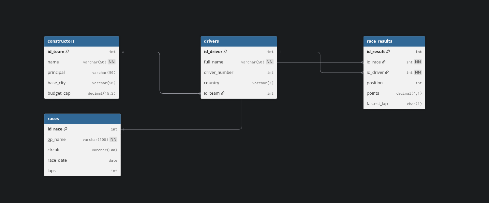

# F1 Database Project (PL/SQL)

This is a project I worked on for my Database course at ENSA. I used Oracle PL/SQL to create a relational database for managing a Formula 1 Championship.

The main idea was to practice connecting tables using foreign keys and writing a stored procedure to handle data updates automatically.

## Database Structure

The image below shows how the tables (Constructors, Drivers, and Races) are related to each other.




## Files

* `f1.sql` - The script with the table creation, sample data, and the PL/SQL procedure.
* `diagram.png` - The image showing the database schema.

## Table Overview

I organized the data into four main tables:

1.  **Constructors**: Stores team information.
2.  **Drivers**: Stores driver details.
3.  **Races**: The list of Grand Prix events.
4.  **Race_Results**: This links drivers to races to store the position and points for each event.

## PL/SQL Feature: Driver Transfer

Instead of manually looking up a team ID and writing an `UPDATE` query every time a driver changes teams, just run this procedure with the driver number and the new team name:

```sql
-- Example: Move Carlos Sainz (55) to Williams
BEGIN
    transfer_driver(55, 'Williams');
END;
/