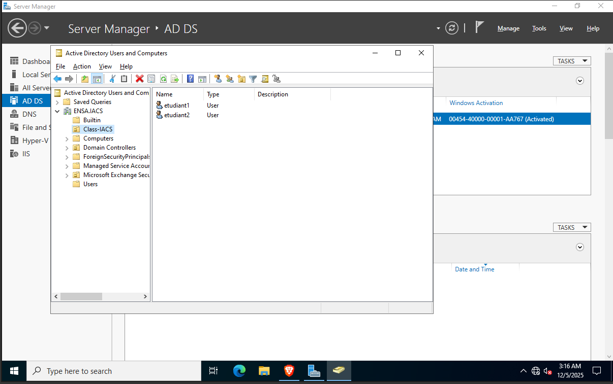
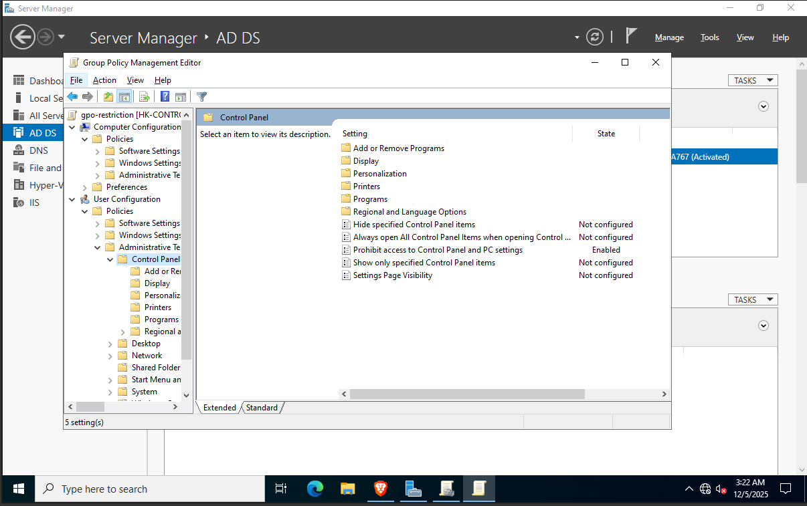
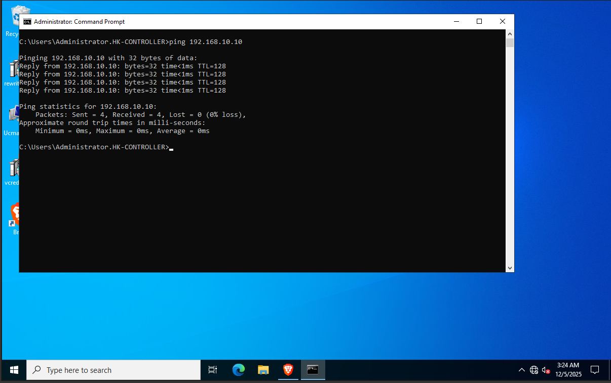
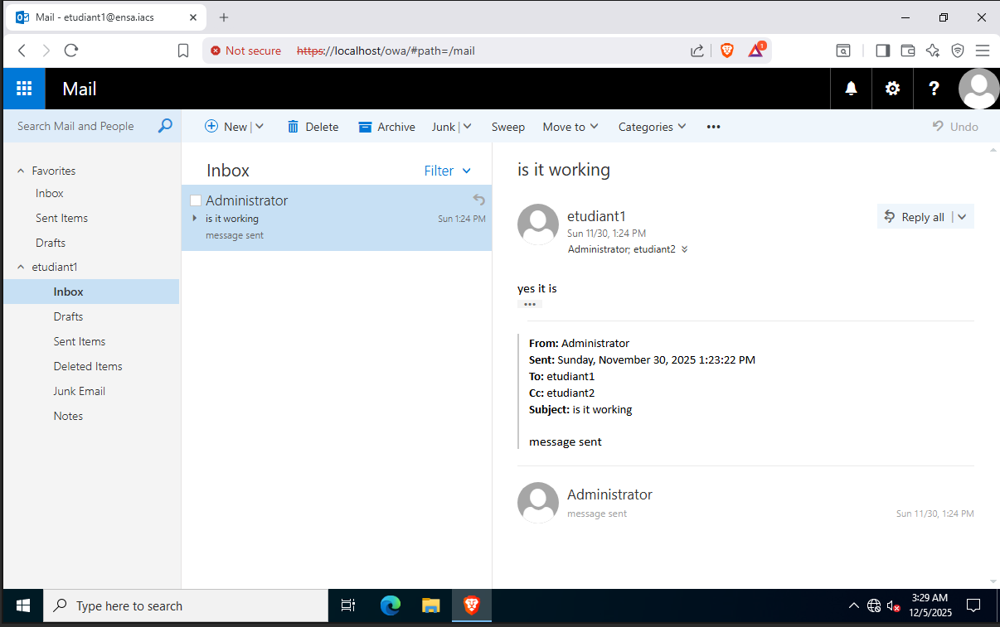

# Windows Server Infrastructure & Active Directory Lab

**Context:** ENSA Beni Mellal - Mini-Project 

##  Project Overview
I deployed a virtualized client-server infrastructure to simulate a corporate network. The project focused on configuring **Windows Server 2019/2022** as a Domain Controller, setting up internal messaging with **Exchange**, and managing **Windows 10** clients through centralized policies.

##  Technical Implementation

### 1. Network & Virtualization
* **Hypervisor:** Used Hyper-V to create an isolated internal network.
* **Topology:**
    * **Server:** Static IP, configured as DNS & DHCP server.
    * **Client:** Dynamic IP, joined to the `ENSA.IACS` domain.

### 2. Identity Management (Active Directory)
* **Domain:** `ENSA.IACS`
* **Users & Groups:** Created organizational units (OUs) for students (`Class-IACS`) and faculty.
* **Authentication:** Centralized user management allowing users to log in from any client machine in the domain.

### 3. Security & GPO (Group Policy Objects)
I implemented security rules to restrict client machine behavior:
* **Control Panel Lock:** Disabled access to settings to prevent unauthorized configuration changes.
* **Password Policy:** Enforced complexity requirements (length + special characters).
* **Environment:** Standardized desktop backgrounds across the department.

### 4. Enterprise Services (Exchange & DNS)
* **DNS:** Configured for local domain name resolution.
* **RDP:** Enabled Remote Desktop Protocol for server administration.
* **Exchange Server:** Deployed on-premise messaging.
    * Configured Mailbox Database and Client Access.
    * Validated internal mail flow between users (e.g., `student1` to `student2`) via Outlook Web Access (OWA).

##  Implementation Evidence

| Category | Description |
| :--- | :--- |
| **Active Directory** |   *Created `ENSA.IACS` domain with Student/Faculty OUs.* |
| **GPO Security** |   *Policy enforcing restrictions on Control Panel access (Status: Enabled).* |
| **Connectivity** |   *Successful ICMP ping verification between Client and Server.* |
| **Messaging** |   *Internal email delivery confirmed via OWA (Admin to Student).* |

