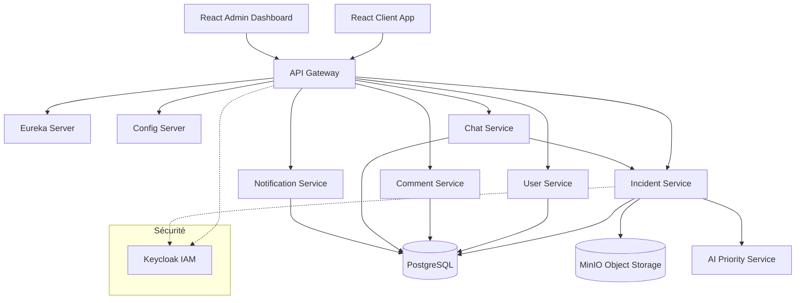

# Documentation du Projet de Gestion d'Incidents

## 1. Architecture Globale

L'application suit une architecture microservices moderne avec les composants suivants :



## 2. Sécurité

- **Authentification** : Gérée par Keycloak via le protocole OAuth2/OIDC.
- **Autorisation** : Chaque microservice valide le jeton JWT (JSON Web Token) via Spring Security.
- **Passerelle (Gateway)** : Centralise la validation des jetons pour toutes les requêtes entrantes.

## 3. Guide de Déploiement

### Prérequis
- Docker & Docker Compose
- Java 17 (pour le développement local)
- Node.js (pour le développement frontend)

### Lancement avec Docker Compose
1. Assurez-vous d'avoir les images Docker prêtes (ou laissez Docker Compose les construire) :
   ```bash
   ./start.sh
   ```
2. Accédez aux services :
   - Frontend Client : `http://localhost:3000`
   - Admin Dashboard : `http://localhost:3003`
   - Keycloak : `http://localhost:8180` (admin/admin)
   - Eureka : `http://localhost:8761`

### Arrêt des services
```bash
./stop.sh
```

## 4. Guide Utilisateur

### Création d'un Incident
1. Connectez-vous sur le `Client App`.
2. Utilisez l'assistant AI (Chatbot) en bas à droite pour décrire votre problème.
3. Si une solution existe, le chatbot vous la proposera.
4. Sinon, créez un incident via le formulaire avec une capture d'écran.

### Gestion des Incidents (Admin)
1. Connectez-vous sur l' `Admin Dashboard`.
2. Visualisez les statistiques globales.
3. Modifiez le statut d'un incident (Nouveau -> Assigné -> En Cours -> Résolu).
4. Ajoutez une solution lors de la résolution pour alimenter le chatbot.

## 5. Fonctionnalités Avancées

- **AI Priority Service** : Analyse automatiquement la description de l'incident pour lui assigner une priorité (Faible, Moyenne, Haute).
- **Notifications en Temps Réel** : Les administrateurs reçoivent des notifications via WebSockets lors de la création d'un nouvel incident.
- **Système de Commentaires** : Permet un échange continu entre utilisateurs et techniciens avec support des pièces jointes.
- **Statistiques Avancées** : Tableau de bord admin avec répartition par statut et priorité en temps réel.
- **Stockage d'Images & Avatars** : Gestion des captures d'écran d'incidents et des avatars utilisateurs via MinIO.
