# Incident Management System

**Supervised by:** [Pr. ELBAGHAZAOUI](https://github.com/bahaa-eddine)

## Overview
This is a microservices-based Incident Management System. It provides a full-stack solution with distinct microservices for handling users, incidents, comments, notifications, and real-time chat, along with an AI-driven service for assigning priority. It includes two frontend applications (Client and Admin).

## Architecture & Services
The backend relies on Spring Boot, Spring Cloud, and FastAPI for the microservices architecture, secured by Keycloak and using an API Gateway for routing.

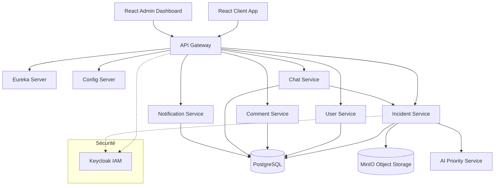

### Core Microservices (Java / Spring Boot)
- **user-service:** Manages user accounts.
- **incident-service:** Handles the creation and tracking of incidents.
- **comment-service:** Manages discussions related to incidents.
- **notification-service:** Handles user notifications.
- **chat-service:** Real-time chat functionality.

### AI Service (Python / FastAPI)
- **ai-priority-service:** Uses AI algorithms to automatically assess and assign incident priority levels.

### Infrastructure & Discovery (Spring Cloud)
- **gateway-service:** The primary entry point for external traffic, routing to internal microservices.
- **eureka-server:** Service registry for dynamic discovery.
- **config-service:** Centralized configuration service pulling from `config-repo`.

### Frontend (React)
- **admin-dashboard:** Dashboard for administrators.
- **client-app:** User-facing application for reporting incidents.

## Technologies Used

**Backend:**
- Java, Spring Boot, Spring Cloud
- Python, FastAPI, Uvicorn, Pydantic

**Databases & Storage:**
- PostgreSQL (Primary Relational Database)
- MinIO (S3-compatible Object Storage)

**Security & Identity:**
- Keycloak (OAuth2 / OIDC)

**Frontend:**
- React.js, Node.js

**DevOps & Deployment:**
- Docker, Docker Compose

## Visual Evidence

### Client Application
| Client Home | Client Dashboard |
|:---:|:---:|
|  |  |

| Report Incident | Incident Submission |
|:---:|:---:|
| 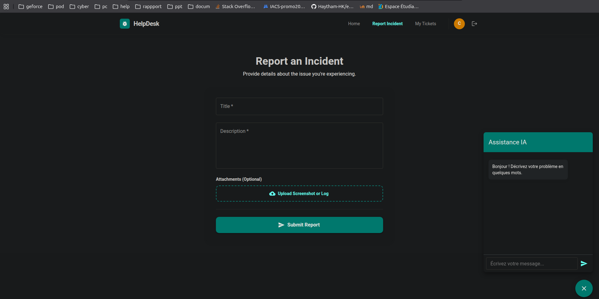 | 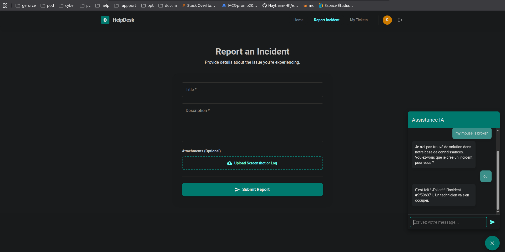 |

| Incident List | Chat Feature |
|:---:|:---:|
| 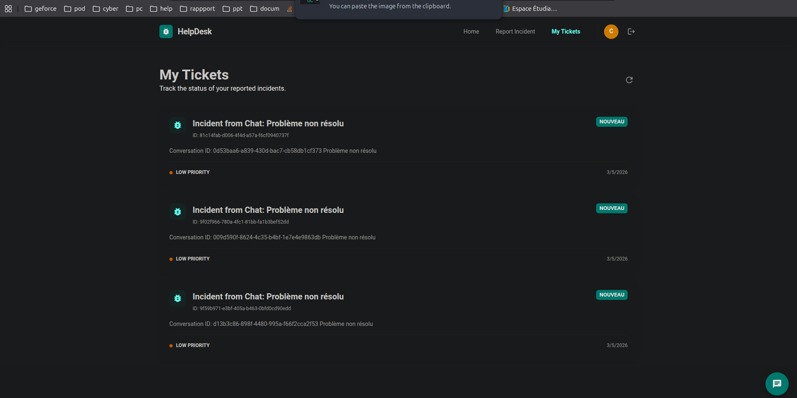 |  |

### Admin Dashboard
| Admin Login | Admin Dashboard |
|:---:|:---:|
| 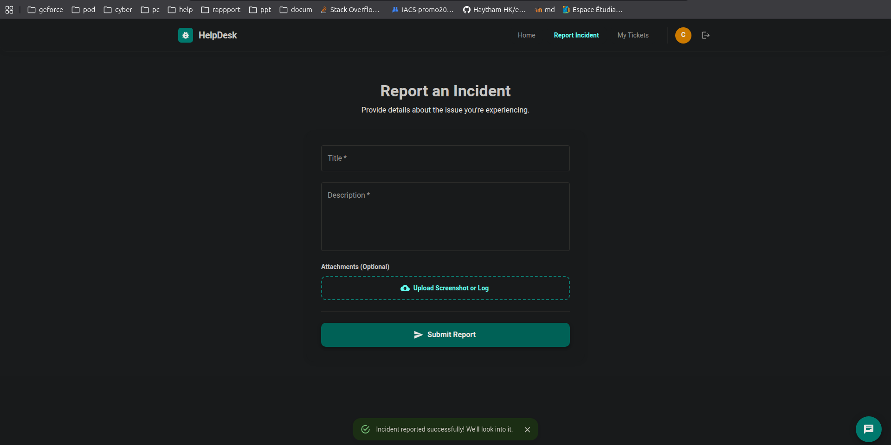 |  |

| Admin Incidents | Admin Incident Edit |
|:---:|:---:|
| 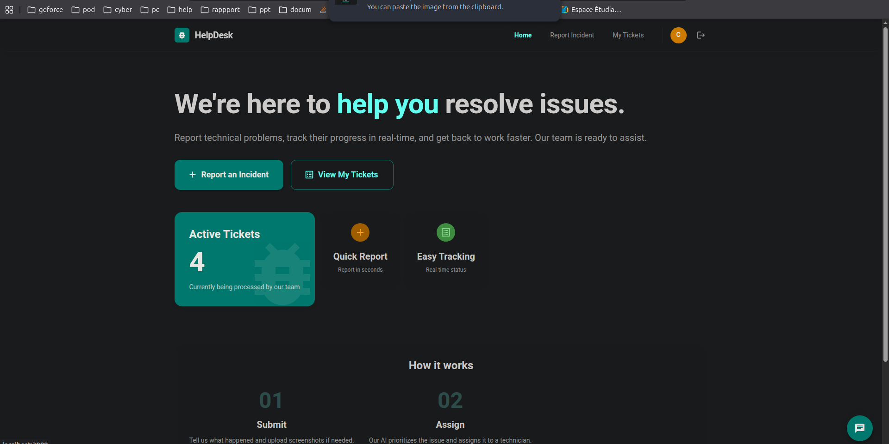 | 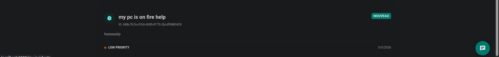 |

| User Management | System Status |
|:---:|:---:|
| 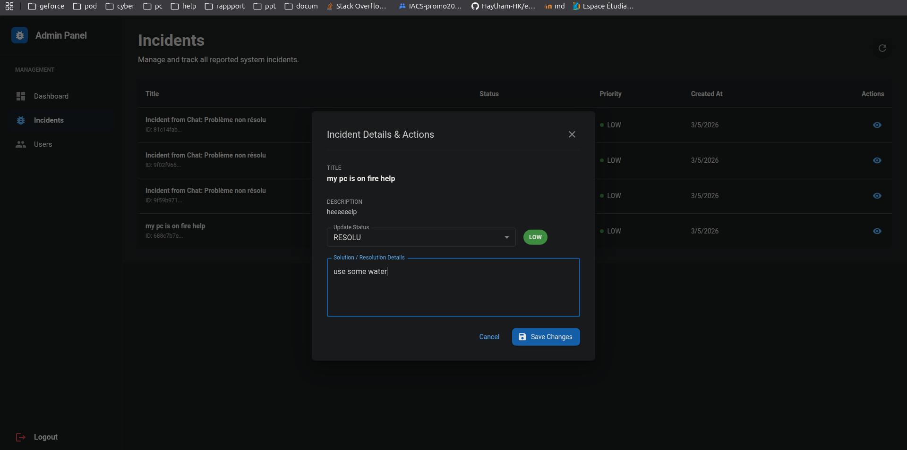 | 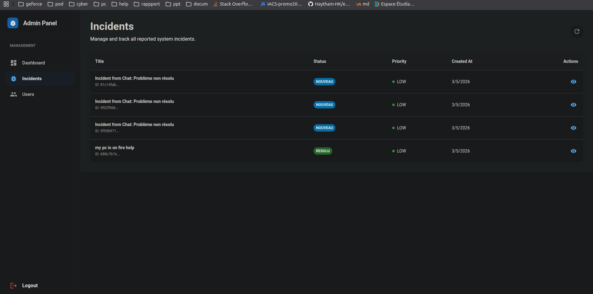 |

### Advanced Features
| Real-time Notifications | AI Priority Assignment |
|:---:|:---:|
| 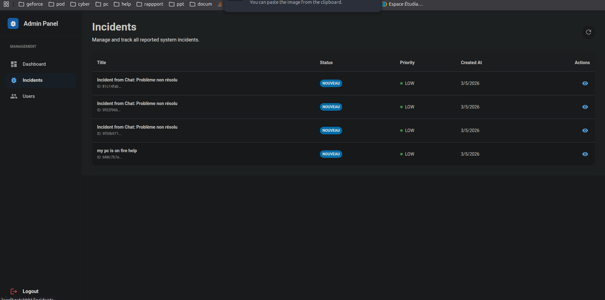 | 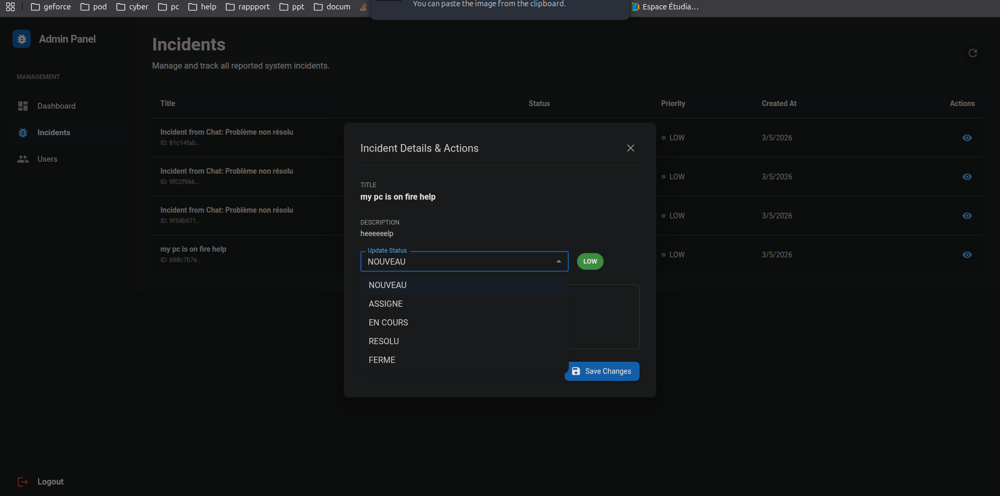 |

## Development

The central configuration files for all microservices are located in the `config-repo` directory. The main backend and frontend code resides under the `gestion-incidents` directory.

For more details, see [DOCUMENTATION.md](DOCUMENTATION.md).
