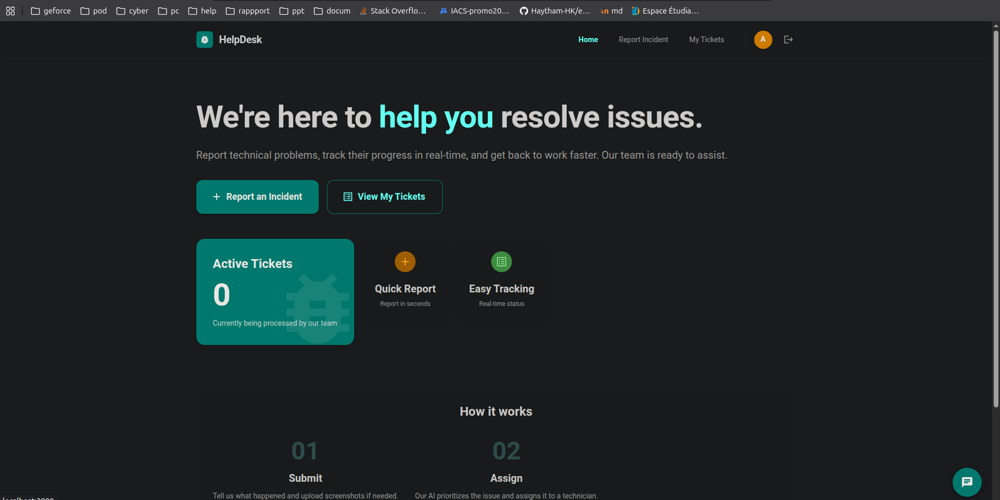
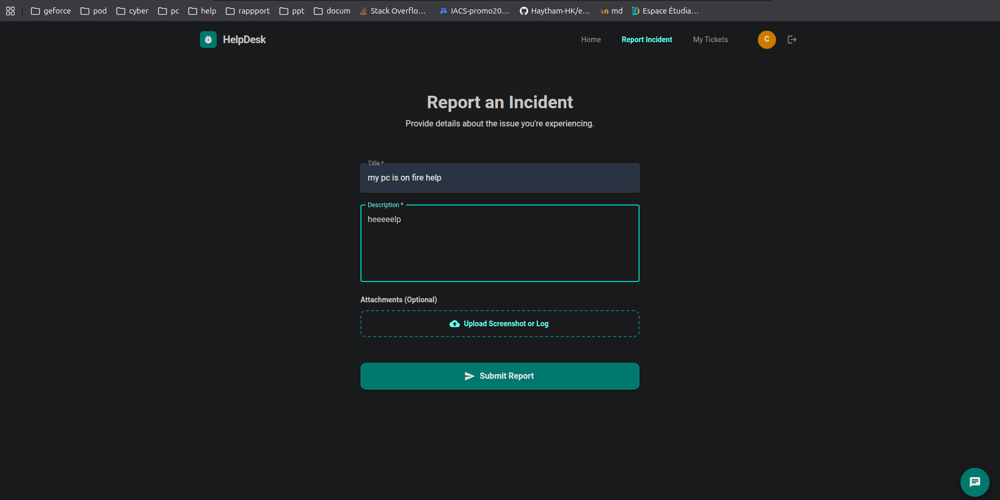
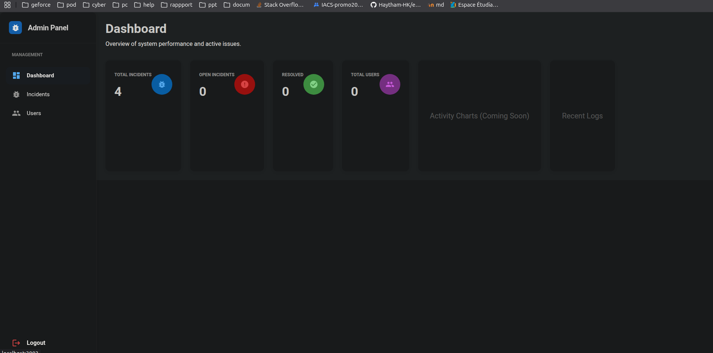

# Gestion d'Incidents Microservices

Une application moderne et scalable pour la gestion des incidents, construite avec une architecture microservices (Spring Boot, Python, React).

## 📸 Aperçu de l'Application

### 👤 Interface Client
| Accueil Client | Dashboard Personnel |
| :---: | :---: |
|  |  |

| Signalement d'un Incident | Suivi des Tickets |
| :---: | :---: |
|  |  |

### 🛠️ Interface Administration
| Dashboard Admin | Gestion des Incidents |
| :---: | :---: |
|  |  |

| Édition & Solution | Gestion des Utilisateurs |
| :---: | :---: |
|  |  |

### 🚀 Fonctionnalités Avancées
| Chat en Temps Réel | Analyse de Priorité (IA) |
| :---: | :---: |
|  |  |

## 🛠️ Architecture Technique

- **Backend:** Spring Boot, Spring Cloud (Eureka, Config, Gateway)
- **IA:** Python (FastAPI/Uvicorn) pour le tri intelligent des priorités
- **Frontend:** React.js avec Material UI
- **Sécurité:** Keycloak (OAuth2/OIDC)
- **Base de données:** PostgreSQL, MinIO (Stockage d'images)
- **Messaging:** RabbitMQ (Notifications)
- **Déploiement:** Docker, Docker Compose

## 🚦 Démarrage Rapide

1. Assurez-vous que Docker est installé.
2. Lancez le script de démarrage :
   ```bash
   ./start.sh
   ```
3. Accédez aux services :
   - Client App: `http://localhost:3000`
   - Admin App: `http://localhost:3003`
   - Eureka: `http://localhost:8761`
   - Keycloak: `http://localhost:8180`
