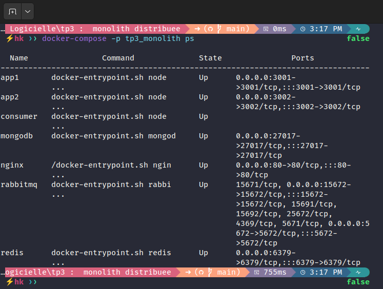
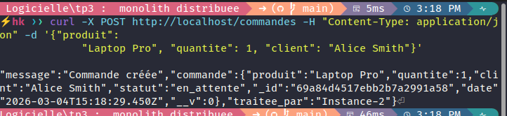
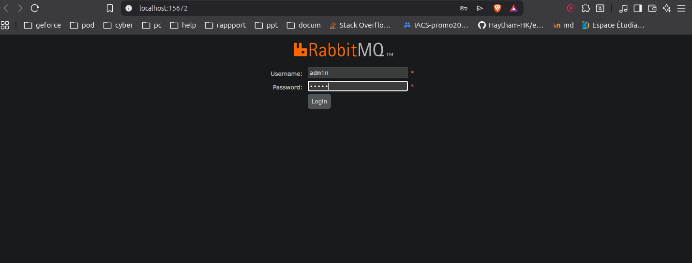
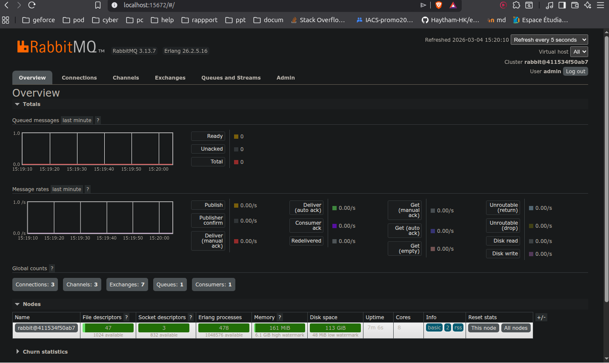

# TP3 - Distributed Monolithic Architecture

## Project Overview
This project involves setting up a distributed and resilient software architecture. It demonstrates the integration of several key technologies to ensure scalability, performance, and reliability of an order management system.

## Architecture
- **Load Balancing (Nginx)**: Traffic distribution among multiple application instances.
- **Application Servers (Node.js)**: Management of distributed business logic.
- **Persistence (MongoDB)**: Persistent storage for order data.
- **Performance (Redis)**: Caching of frequent requests to reduce latency.
- **Asynchrony (RabbitMQ)**: Message communication for notifications and service decoupling.

## Proof of Operation (Screenshots)

### 1. Container Status (Docker Compose)
All services are operational and interconnected.

### 2. Order Creation (POST)
Testing order creation via the API, processed by a specific instance.

### 3. Load Balancing & Redis Cache
Demonstration of load balancing (Round-robin) and acceleration via the Redis cache (Source: Cache vs MongoDB).

### 4. RabbitMQ Consumer (Notifications)
Logs from the independent microservice receiving and processing order messages asynchronously.

## Implemented Features
- REST API for order creation and consultation.
- "Cache-Aside" strategy with automatic invalidation.
- Round-robin request distribution.
- Asynchronous processing of order events via a dedicated consumer.
