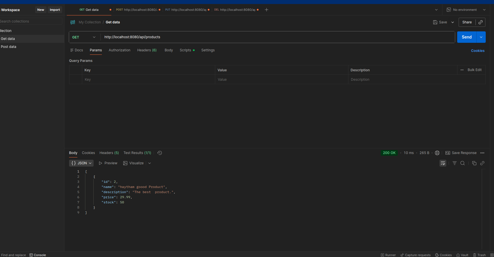
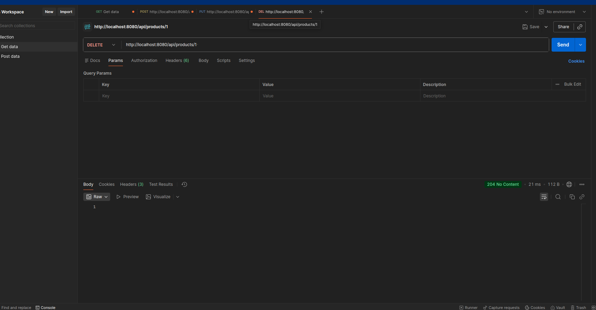
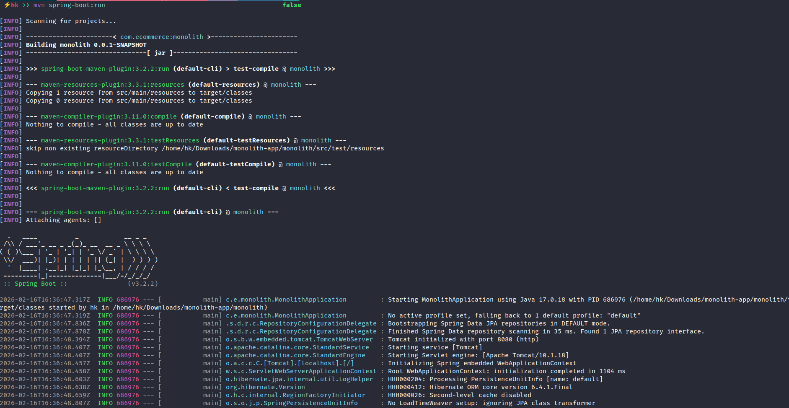

# TP 1: Simple Monolithic E-commerce Application

This project is a simple monolithic application for managing products in an e-commerce setting. It's built with Spring Boot and provides a REST API for CRUD operations on products. This was a practical work for my first year, where I learned about monolithic architectures, Spring Boot, and building REST APIs.

## Features

-   **Product Management**: CRUD operations for products.
-   **Category Management**: CRUD operations for categories.
-   **Product-Category Relationship**: Products can be assigned to a category.

### Categories

| Method | URL                  | Description                  |
| ------ | -------------------- | ---------------------------- |
| GET    | /categories          | List all categories          |
| GET    | /categories/{id}     | Get a specific category      |
| POST   | /categories          | Create a new category        |
| PUT    | /categories/{id}     | Update a category            |
| DELETE | /categories/{id}     | Delete a category            |
| GET    | /categories/{id}/products | List products in a category |

### Products

| Method | URL                  | Description                  |
| ------ | -------------------- | ---------------------------- |
| GET    | /products            | List all products            |
| GET    | /products/{id}       | Get a specific product       |
| POST   | /products            | Create a new product         |
| PUT    | /products/{id}       | Update a product             |
| DELETE | /products/{id}       | Delete a product             |
| GET    | /products/{id}/category | Get the category of a product |
| GET    | /products/search/by-name?name={name} | Search for products by name |

## Evidence

Here are some screenshots of my work:

