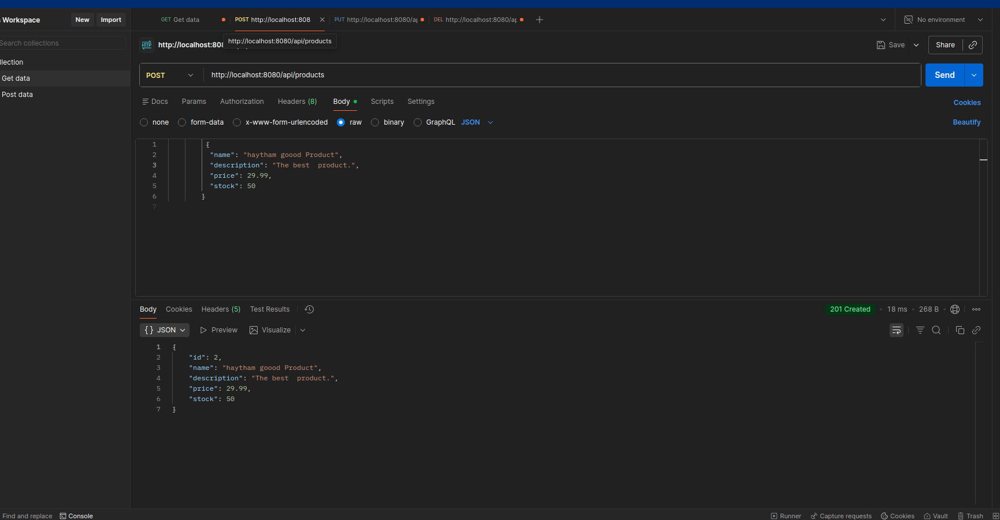
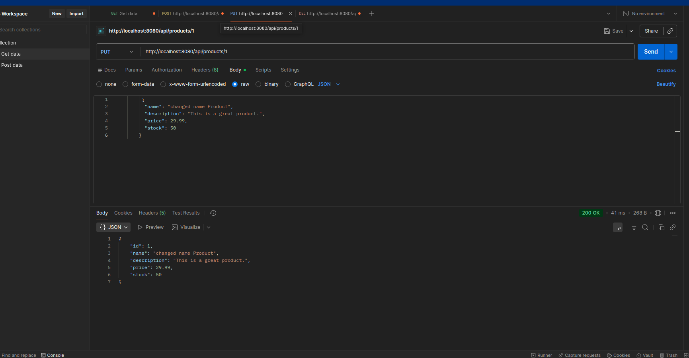
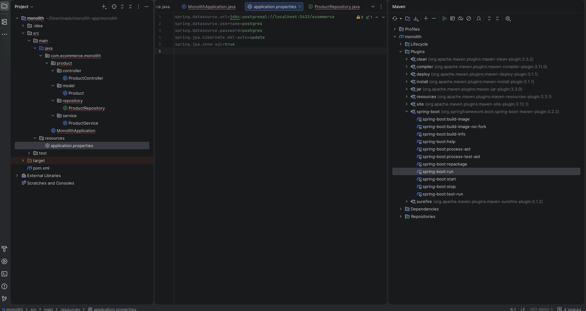

# TP 1: Simple Monolithic E-commerce Application

This project is a simple monolithic application for managing products in an e-commerce setting. It's built with Spring Boot and provides a REST API for CRUD operations on products. This was a practical work for my first year, where I learned about monolithic architectures, Spring Boot, and building REST APIs.

## My Approach

I followed the steps provided in the practical work document (`TP1_Monolithe_Simple.pdf`).

1.  **Project Setup:** I started by initializing a Spring Boot project using Spring Initializr, including dependencies like Spring Web, Spring Data JPA, and Lombok.

2.  **Data Model:** I created the `Product` entity, which represents a product with properties like name, description, price, and stock.

3.  **Persistence:** I implemented the `ProductRepository` to handle database operations for the `Product` entity. I also explored using `@RepositoryRestResource` to automatically expose REST endpoints.

4.  **Business Logic:** The `ProductService` was created to implement the business logic for managing products, such as creating, updating, and retrieving them.

5.  **API Layer:** I developed the `ProductController` to expose the REST endpoints for the product management functionality.

6.  **Testing:** I used Postman to test the API endpoints and ensure that all CRUD operations were working correctly.

## Evidence

Here are some screenshots of my work:

