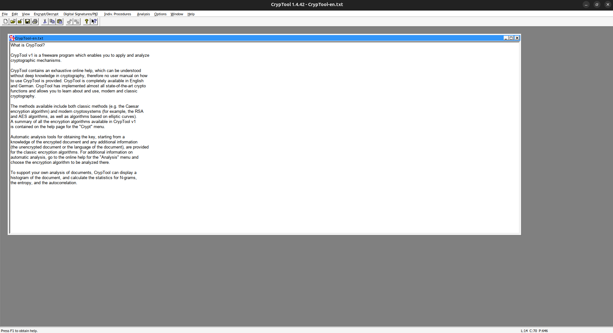
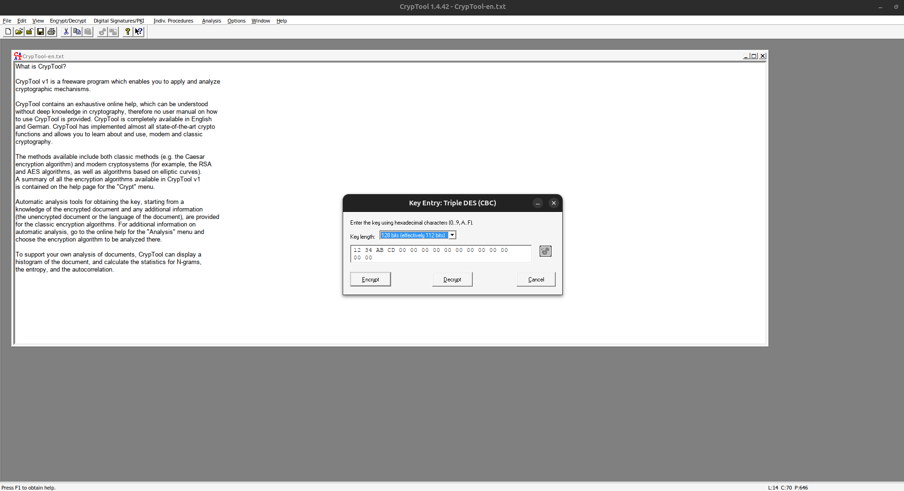
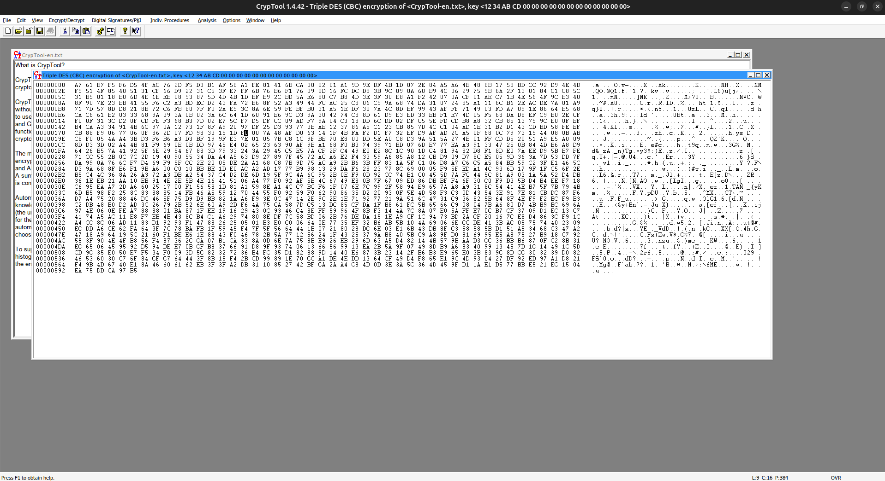
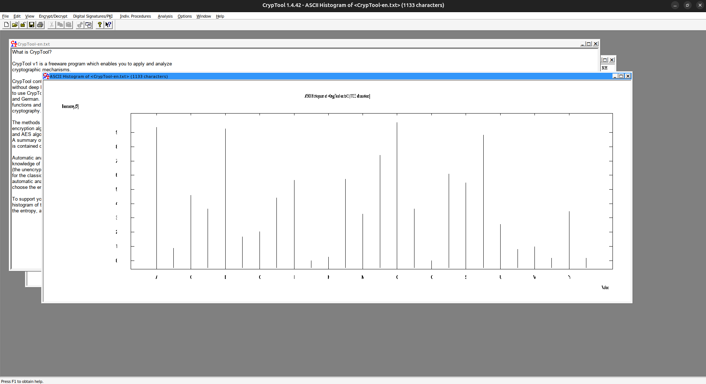
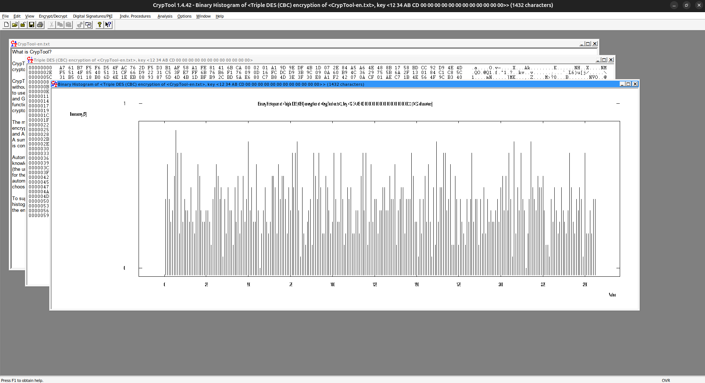
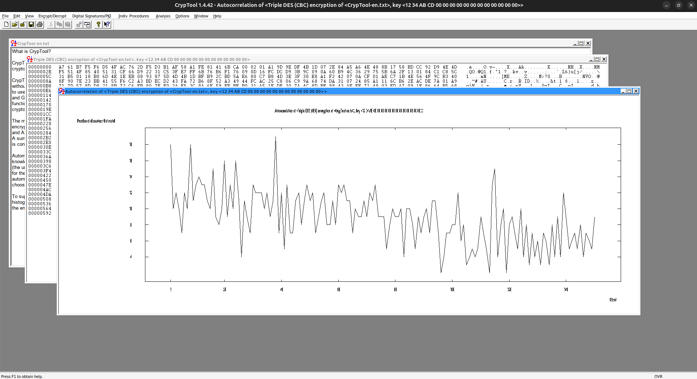
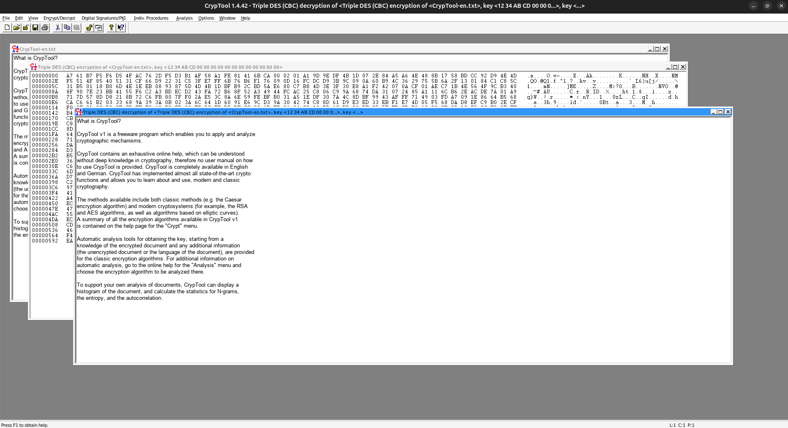
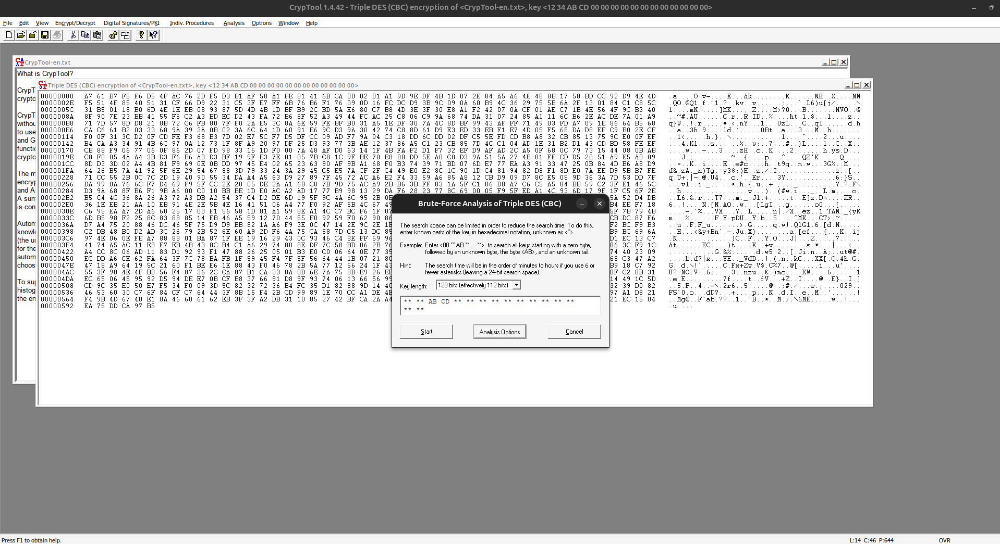
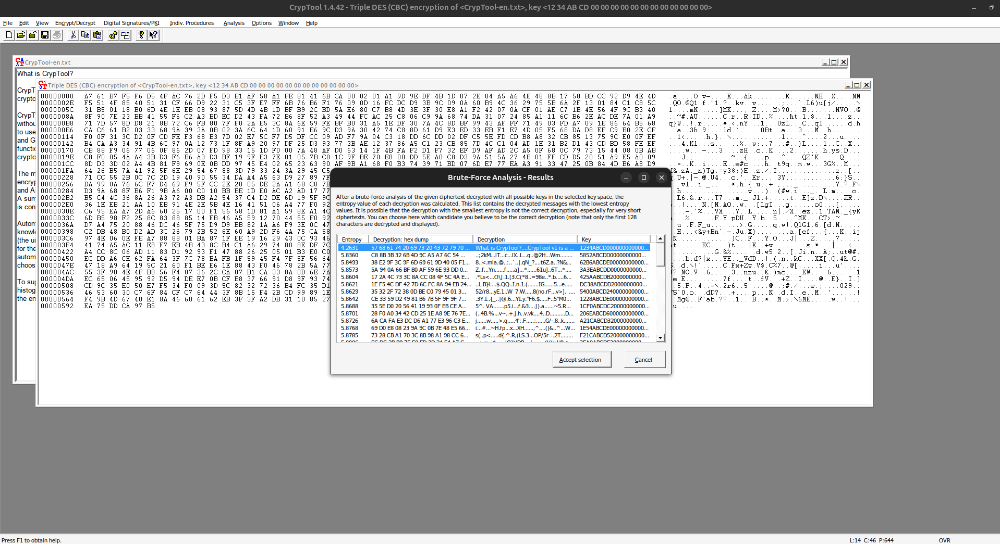
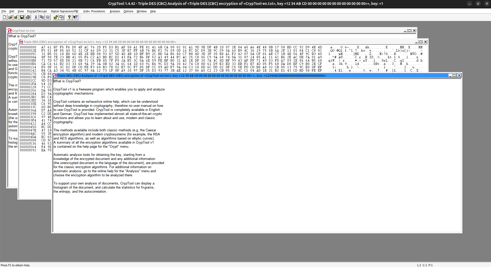

# IACS26 - Cryptographie  
## TP n°2 : Cryptographie Symétrique  
### Rapport — Exercice 1 : 3DES (mode CBC)

**Filière :** IACS-S2  
**Matière :** Cryptographie  
**Professeur :** Pr. K. OUNACHAD  
**Nom :** Haytham Kennouz  

---

## Objectif de l’exercice

Appliquer l’algorithme **Triple-DES en mode CBC** avec CrypTool, observer les effets statistiques du chiffrement, puis retrouver la clé par une **attaque par force brute** sur une plage de clés.

## Réponses aux étapes de l’énoncé + interprétation

### 1) Ouverture du fichier texte d’exemple

Le fichier `CrypTool-en.txt` est ouvert depuis le dossier des exemples.

{ width=95% }

**Interprétation :** le document clair sert de base pour comparer le texte avant/après chiffrement.

### 2) Saisie de la clé Triple-DES (CBC)

Le chiffrement symétrique classique Triple-DES (CBC) est paramétré avec la clé demandée `12 34 AB CD`.

{ width=95% }

**Interprétation :** la clé est l’élément secret principal ; en CBC, le traitement se fait bloc par bloc avec chaînage.

### 3) Document chiffré généré

Le texte chiffré est produit et affiché.

{ width=95% }

**Interprétation :** le contenu chiffré devient non lisible, ce qui confirme la confidentialité assurée par l’algorithme.

### 4) Histogramme du document clair (ASCII)

L’histogramme du texte clair présente une distribution structurée des caractères.

{ width=95% }

**Interprétation :** les fréquences des lettres/espaces sont non uniformes, ce qui reflète la redondance naturelle du langage.

### 5) Histogramme du document chiffré (binaire)

L’histogramme du texte chiffré devient nettement plus “plat”/irrégulier.

{ width=95% }

**Interprétation :** la distribution du chiffré ne ressemble plus à celle du clair, ce qui masque les motifs statistiques.

### 6) Autocorrélation du document chiffré

L’autocorrélation ne montre pas de périodicité exploitable.

{ width=95% }

**Interprétation :** aucun indice évident sur la longueur de clé n’apparaît, contrairement à des chiffrements plus faibles.

### 7) Déchiffrement avec la clé correcte

Le document est déchiffré en sélectionnant le mode “Déchiffrer”.

{ width=95% }

**Interprétation :** le texte redevient lisible, validant que chiffrement et déchiffrement sont inverses avec la bonne clé.

### 8) Paramétrage de la force brute Triple-DES

La plage de recherche de clé est configurée conformément à l’énoncé (`** ** AB CD`).

{ width=95% }

**Interprétation :** l’attaque limite l’espace de recherche à une plage définie, ce qui réduit le coût de calcul.

### 9) Résultat de la force brute

CrypTool trouve une clé candidate valide.

{ width=95% }

**Interprétation :** lorsque la plage contient la vraie clé, l’attaque la retrouve.

### 10) Restauration finale du texte clair

Après validation de la clé trouvée, le texte original est restauré.

{ width=95% }

**Interprétation :** la clé découverte permet un déchiffrement correct du document initial.

---

## Conclusion

L’exercice montre que **3DES en mode CBC** masque efficacement la structure statistique du texte clair (histogramme/autocorrélation), rendant l’analyse directe difficile. En revanche, une **attaque par force brute** devient possible si l’espace de clés est suffisamment restreint. La sécurité dépend donc fortement de la taille réelle de l’espace de recherche et de la confidentialité de la clé.
---
## Exercice 2 : AES (128 bits)

### 1- Chiffrement simple avec CrypTool 2

#### a- Chiffrement AES en mode ECB

Le texte `Bonjour AES pour IACS ENSABM` est chiffré avec la clé `1234567890123456` en mode **ECB (Electronic Code Book)**.

{ width=95% }

**Réponses :**
- **Le texte chiffré est-il lisible ?** Non, le texte chiffré est une suite d'octets hexadécimaux inintelligible.
- **Pourquoi AES produit-il un texte "aléatoire" ?** AES est conçu pour être une permutation pseudo-aléatoire. Chaque bloc de texte clair est transformé en un bloc de texte chiffré de manière à ce qu'il n'y ait pas de corrélation statistique visible entre les deux.

### 2- Déchiffrement

Le texte chiffré est déchiffré avec la même clé.

{ width=95% }

**Réponses :**
- **Retrouve-t-on le texte initial ?** Oui, le texte initial est entièrement restauré.
- **Que se passe-t-il si la clé est incorrecte ?** Le déchiffrement produira un texte inintelligible.

### 3- Influence de la clé

Un seul caractère de la clé est modifié (`1234567890123457`).

{ width=95% }

**Réponses :**
- **Le résultat change-t-il beaucoup ?** Oui, le texte chiffré est complètement différent.
- **Comment expliquer cet effet (effet avalanche) ?** L'effet avalanche est une propriété souhaitable des algorithmes de chiffrement où un petit changement dans l'entrée (ici, la clé) produit un changement significatif dans la sortie. Cela garantit qu'un attaquant ne peut pas déduire la clé en observant les changements dans le texte chiffré.

### 4- Modes de chiffrement

#### a- Différence entre ECB et CBC

- **ECB (Electronic Code Book) :** Chaque bloc de texte clair est chiffré indépendamment avec la même clé. **Inconvénient :** des blocs de texte clair identiques produisent des blocs de texte chiffré identiques, ce qui peut révéler des motifs.
- **CBC (Cipher Block Chaining) :** Chaque bloc de texte clair est XORé avec le bloc de texte chiffré précédent avant d'être chiffré. Le premier bloc est XORé avec un **vecteur d'initialisation (IV)**.

#### b- Pourquoi ECB est-il déconseillé ?

ECB est déconseillé car il ne masque pas les motifs de données. Si un message contient des blocs identiques, le texte chiffré contiendra également des blocs identiques, ce qui peut être exploité par un attaquant.

#### c- Quel est le rôle du IV (vecteur d'initialisation) ?

Le IV est utilisé pour initialiser le processus de chiffrement en mode CBC (et d'autres modes). Il garantit que même si le même message est chiffré plusieurs fois avec la même clé, le résultat sera différent à chaque fois. Le IV n'a pas besoin d'être secret, mais il doit être unique pour chaque session de chiffrement.

### 5- Analyse visuelle (très important)

#### Chiffrement d'une image en mode ECB

{ width=95% }

**Réponses :**
- **Que remarquez-vous avec ECB ?** La structure de l'image originale est toujours visible dans l'image chiffrée.
- **Pourquoi voit-on encore la structure de l'image ?** Parce que les blocs de couleur unie (par exemple, le blanc de fond) sont tous chiffrés de la même manière, préservant ainsi les contours de l'image.

#### Chiffrement d'une image en mode CBC

{ width=95% }

**Réponse :**
- **Quel mode est le plus sécurisé ?** Le mode CBC est plus sécurisé car il masque complètement la structure de l'image, produisant un résultat qui ressemble à du bruit aléatoire.

### 6- Attaque simple (analyse)

#### Bit-flip en mode ECB

{ width=95% }

#### Bit-flip en mode CBC

{ width=95% }

**Réponses :**
- **Observer le texte chiffré :** En mode ECB, la modification d'un bit dans le texte clair n'affecte que le bloc correspondant dans le texte chiffré. En mode CBC, la modification d'un bit affecte le bloc correspondant et le bloc suivant.
- **Pourquoi cet effet est important en cryptographie ?** Comprendre comment les changements se propagent est crucial pour la conception de protocoles sécurisés. Par exemple, l'intégrité des données peut être compromise si un attaquant peut modifier le texte chiffré de manière prévisible.

### 7- Questions

1.  **Pourquoi AES est-il préféré à DES ?** AES est préféré à DES pour plusieurs raisons : une taille de clé plus grande (128, 192 ou 256 bits contre 56 bits pour DES), une meilleure performance et une résistance aux attaques connues qui ont "cassé" DES.
2.  **Quelle taille de clé est recommandée aujourd'hui ?** Une taille de clé de 128 bits est considérée comme sécurisée pour la plupart des applications. Pour des données très sensibles ou une sécurité à long terme, des clés de 256 bits sont recommandées.
3.  **AES est-il vulnérable aux attaques quantiques ?** Oui, AES (comme la plupart des chiffrements symétriques) est potentiellement vulnérable à l'algorithme de Grover, qui pourrait réduire de moitié la sécurité effective de la clé. Cependant, doubler la longueur de la clé (par exemple, utiliser AES-256) est une contre-mesure efficace.
---
## Exercice 3 : ChaCha20

### 1- Mise en place

Le texte `Bonjour ChaCha20 pour IACS ENSABM` est chiffré avec une clé de 32 octets et un nonce de 12 octets.

{ width=95% }

**Réponses :**
- **Le texte chiffré est-il lisible ?** Non.
- **Pourquoi ChaCha20 produit-il un flux pseudo-aléatoire ?** ChaCha20 est un chiffrement par flot. Il génère un flux de clés pseudo-aléatoire qui est ensuite XORé avec le texte clair pour produire le texte chiffré.

### 2- Déchiffrement

{ width=95% }

**Réponses :**
- **Retrouve-t-on le texte initial ?** Oui.
- **Pourquoi le chiffrement et le déchiffrement utilisent-ils la même opération ?** Parce que l'opération de base est un XOR. `(A XOR B) XOR B = A`. Le déchiffrement consiste simplement à XORer le texte chiffré avec le même flux de clés.

### 3- Rôle du Nonce

Le nonce (number used once) est changé.

{ width=95% }

**Réponses :**
- **Les résultats sont-ils identiques ?** Non, le texte chiffré est complètement différent.
- **Pourquoi le nonce garantit-il l'unicité du chiffrement ?** Le nonce est combiné avec la clé pour générer le flux de clés. Même si la clé est la même, un nonce différent produira un flux de clés différent, et donc un texte chiffré différent.

### 4- Danger critique (IMPORTANT) : Réutilisation du nonce

Deux messages différents sont chiffrés avec la même clé et le même nonce.

{ width=95% }

Le XOR des deux textes chiffrés est calculé.

{ width=95% }

**Réponses :**
- **Que représente le résultat du XOR ?** Le résultat est `C1 \oplus C2 = (P1 \oplus K) \oplus (P2 \oplus K) = P1 \oplus P2`.
- **Peut-on retrouver des informations sur les messages ?** Oui. Si un attaquant connaît l'un des messages clairs (P1 ou P2), il peut retrouver l'autre. De plus, l'analyse fréquentielle du résultat du XOR peut révéler des informations sur les deux messages.
- **Pourquoi cela casse la sécurité ?** La réutilisation du nonce annule la sécurité du chiffrement par flot.

### 5- Analyse du flux

#### Bit-flip avec ChaCha20

{ width=95% }

**Réponses :**
- **Comparer avec AES :** Comme pour les autres chiffrements par flot, un changement d'un bit dans le texte clair n'affecte que le bit correspondant dans le texte chiffré.

### 6- Modification du message

L'effet d'une petite modification dans le message (`Bonjour` -> `bonjouR`) est similaire à un bit-flip : seuls les bits modifiés dans le texte clair sont modifiés dans le texte chiffré.
---
## Exercice 4 : RC4

### 1- Mise en place

Le texte `Bonjour RC4 IACS ENSABM` est chiffré avec la clé `secretkey`.

{ width=95% }

**Réponses :**
- **Le texte chiffré est-il lisible ?** Non.
- **Pourquoi RC4 produit-il un flux aléatoire ?** RC4 est également un chiffrement par flot qui génère un flux de clés pseudo-aléatoire.

### 2- Déchiffrement

{ width=95% }

**Réponse :**
- **Quel est le rôle du XOR ?** Comme pour ChaCha20, le XOR est utilisé pour combiner le texte clair avec le flux de clés. `C = P \oplus K` et `P = C \oplus K`.

### 3- Analyse du flux généré

Le flux généré par RC4 est connu pour avoir des biais statistiques, ce qui le rend moins sécurisé que ChaCha20 ou AES.

### 4- Sensibilité à la clé

Un petit changement dans la clé (`secretkey` -> `secretkez`) produit un flux de clés complètement différent, et donc un texte chiffré complètement différent.

{ width=95% }

### 5- Attaque critique (IMPORTANT) : Réutilisation du keystream

Deux messages différents sont chiffrés avec la même clé.

{ width=95% }

Le XOR des deux textes chiffrés est calculé.

{ width=95% }

**Réponses :**
- **Que représente `C1 \oplus C2` ?** `C1 \oplus C2 = P1 \oplus P2`.
- **Pourquoi c'est dangereux ?** Pour les mêmes raisons que la réutilisation du nonce avec ChaCha20 : cela permet à un attaquant de retrouver des informations sur les messages clairs.
- **Bit-flip avec RC4 :** Un bit-flip dans le texte clair produit un bit-flip correspondant dans le texte chiffré.

{ width=95% }

## Conclusion Générale

Ce TP a permis de mettre en pratique plusieurs algorithmes de chiffrement symétrique et de comprendre leurs forces et leurs faiblesses.

- **3DES** est un algorithme de bloc robuste mais vieillissant et relativement lent.
- **AES** est le standard actuel, offrant un excellent équilibre entre sécurité et performance. Le choix du mode d'opération (par exemple, CBC plutôt qu'ECB) est crucial.
- **ChaCha20** est un chiffrement par flot moderne, rapide et sécurisé, à condition de ne **jamais** réutiliser un nonce avec la même clé.
- **RC4** est un chiffrement par flot plus ancien qui présente des vulnérabilités connues et n'est plus recommandé pour de nouvelles applications.

La sécurité d'un système cryptographique ne repose pas seulement sur la robustesse de l'algorithme, mais aussi sur sa mise en œuvre correcte (gestion des clés, des nonces, des modes d'opération).
