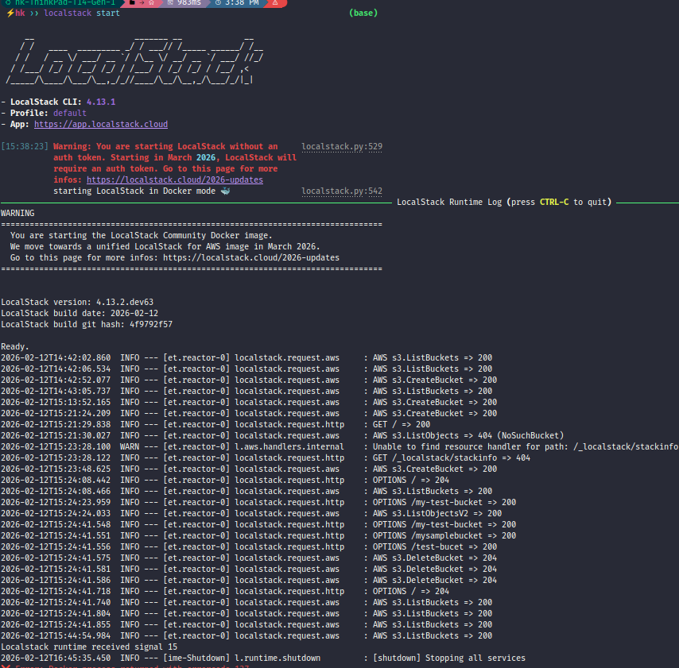
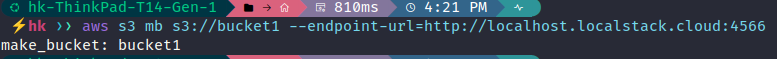
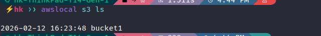

# LocalStack S3 Manipulation Lab

## Description
This project demonstrates the simulation of AWS Cloud services locally using [LocalStack](https://localstack.cloud/). The goal was to interact with the Simple Storage Service (S3) API without incurring cloud costs, verifying the setup via both the LocalStack wrapper and the standard AWS CLI.

## Environment
- **OS:** Linux (Ubuntu/Pop!_OS)
- **LocalStack CLI:** 4.13.1
- **AWS CLI:** 1.44.37
- **Docker:** Used for containerizing the LocalStack service.

## Key Concepts Covered
- **Cloud Simulation:** Running a local AWS environment in Docker.
- **IaC & CLI Tools:** Using `awslocal` and `aws` CLI to manage resources.
- **S3 Operations:** Creating buckets (`mb`) and listing buckets (`ls`).

## Steps & Demonstration

### 1. Starting the LocalStack Service
I initialized the LocalStack runtime in Docker mode.

### 2. Creating an S3 Bucket
I used the standard AWS CLI pointing to the local endpoint to create a new bucket named `bucket1`.

aws s3 mb s3://bucket1 --endpoint-url=[http://localhost.localstack.cloud:4566](http://localhost.localstack.cloud:4566)

### 3. Verification
I verified the bucket creation using the `awslocal` wrapper, which simplifies the command by handling the endpoint URL automatically.

awslocal s3 ls

**Output:**
2026-02-12 16:23:48 bucket1

**Student:** Haytham KENNOUZ