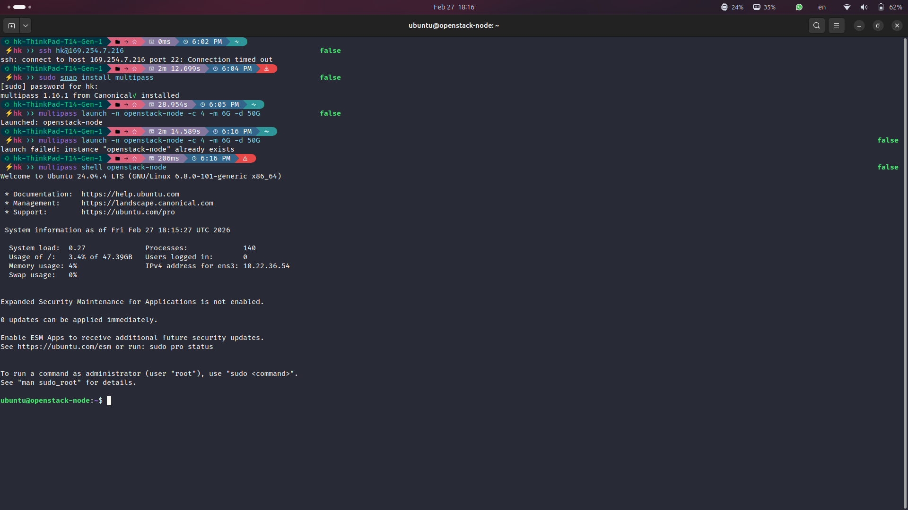
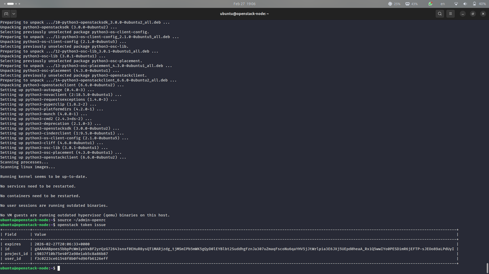
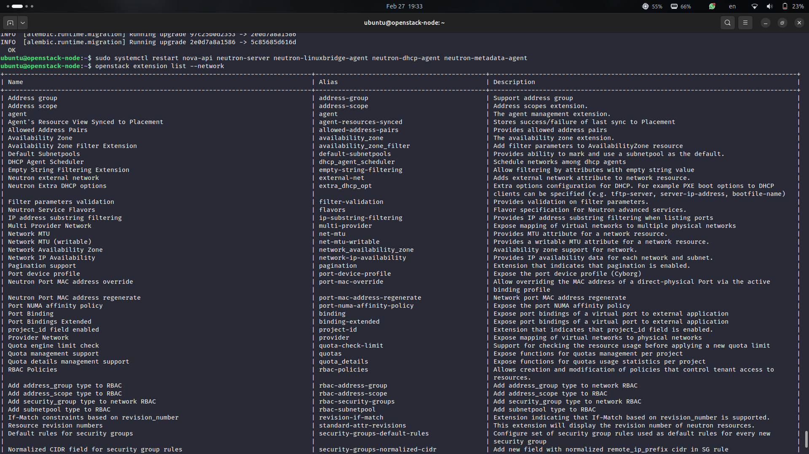
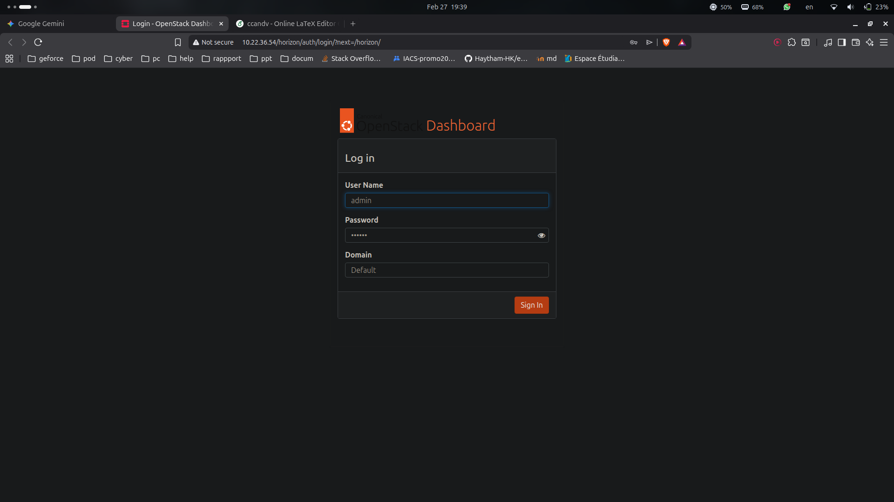
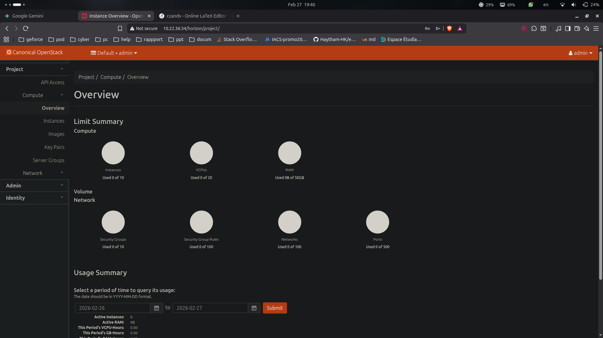
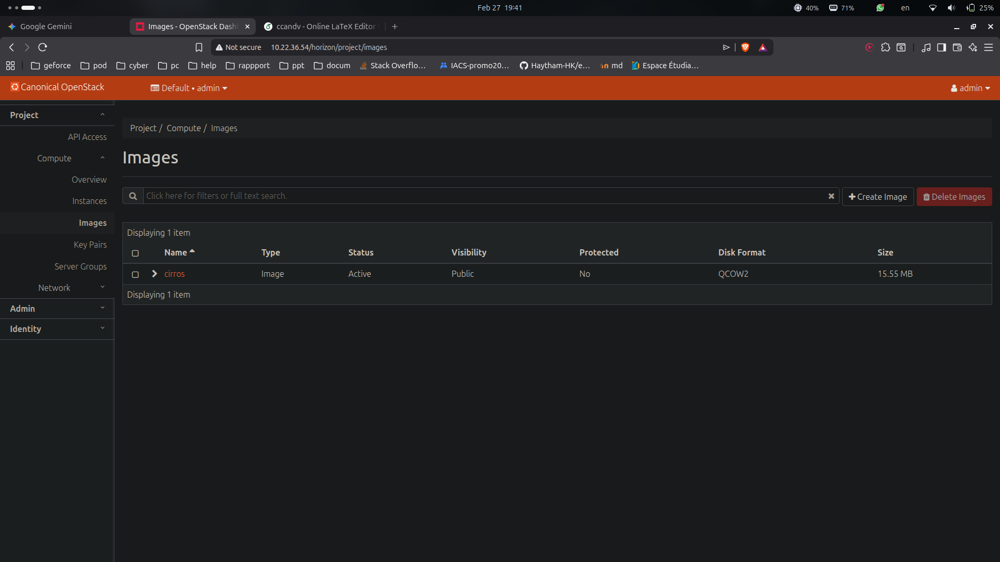
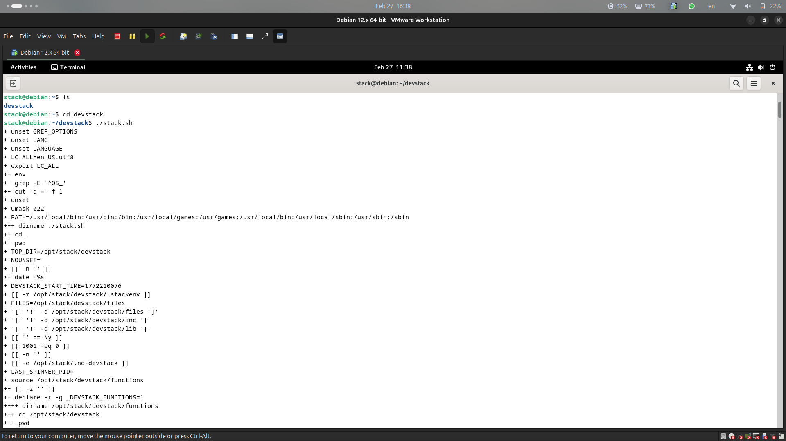

# TP1: OpenStack Fundamentals

## Overview
This laboratory work provided an initiation to the **OpenStack** cloud platform, covering various deployment methods and an exploration of its core services.

## What We Did & Learned

### MicroStack Deployment
We successfully deployed a single-node OpenStack environment using MicroStack. This experience taught us about:
- The simplicity and speed of deploying OpenStack components (Horizon, Keystone, Nova, Neutron, Glance) using Snap packages.
- Basic OpenStack command-line interactions for managing images, flavors, and networks.

**MicroStack Node Launch:**

**OpenStack CLI Authentication:**

### Horizon Dashboard Exploration
We navigated and utilized the OpenStack Horizon dashboard, gaining practical experience in:
- Administering identity services by creating projects, users, and roles.
- Configuring network resources such as networks, subnets, and routers.
- Managing compute resources, including key pairs, images, and launching instances.

**Exploring Network Extensions via CLI:**

**Horizon Dashboard Login:**

**Horizon Dashboard Overview:**

**Managing Images in Horizon:**

### Advanced Deployment Methods (Conceptual Exploration)
We conceptually explored more complex deployment scenarios, understanding the differences between:
- **DevStack:** A script-based deployment for development and testing on Debian 12.
- **Manual Full Installation:** A deep dive into the architectural components by setting up OpenStack without automated tools. This helped in understanding the underlying structure and interdependencies of OpenStack services.

**DevStack Installation Process:**

## Conclusion
This TP provided a foundational understanding of OpenStack, from rapid deployment with MicroStack to an appreciation for the complexities of its architecture through exploring DevStack and manual installation concepts. We gained valuable hands-on experience with cloud infrastructure management.

**Course:** Cloud Computing & Virtualization  

**Student:** Haytham KENNOUZ
