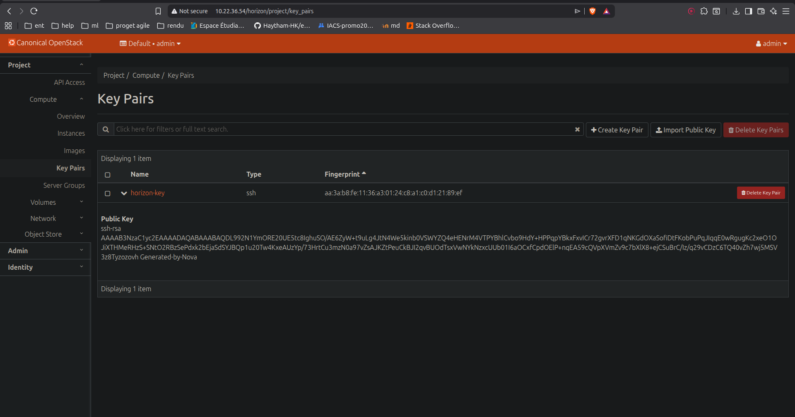
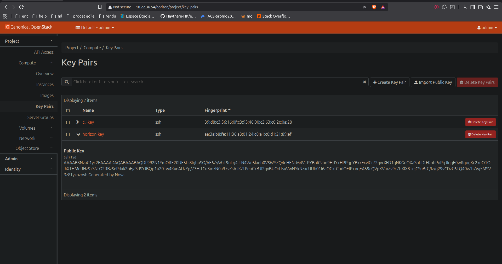
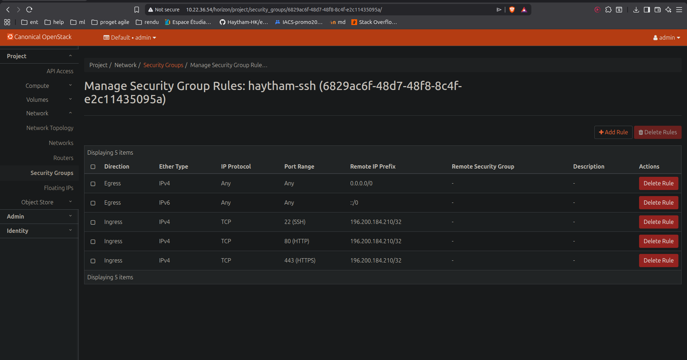
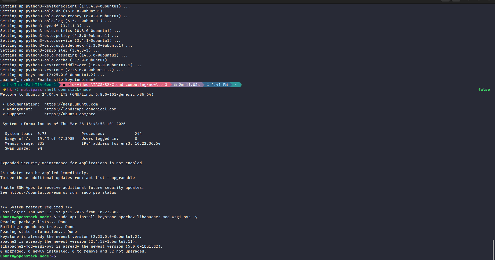
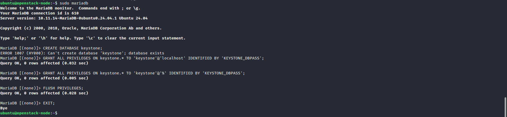
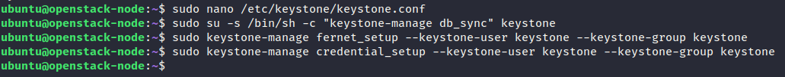
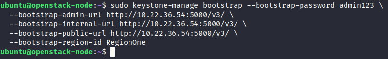
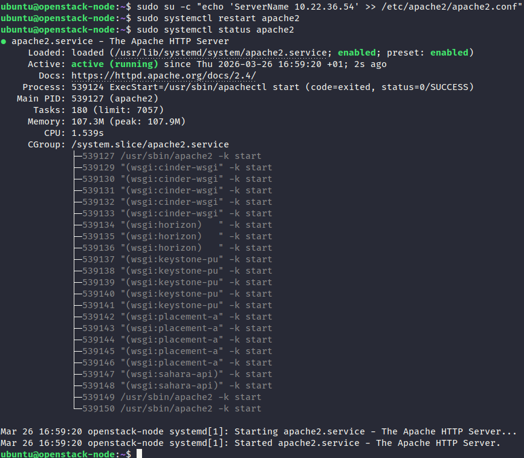
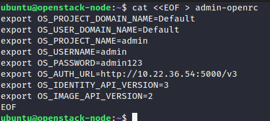
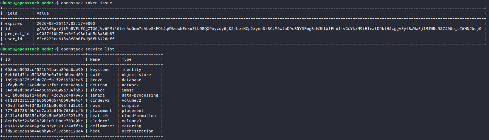

# TP - Cloud VM Provisioning

This project demonstrates the process of setting up a virtual machine and its associated network infrastructure in a cloud environment.

## 1. Virtual Machine Creation

The first step is to create a new virtual machine instance.

## 2. Network and Security Configuration

Next, we configure the network, including security groups and firewall rules, to allow access to the VM.

## 3. Connecting and Running a Service

Once the VM is running and the network is configured, we connect to it and run a basic web service.

