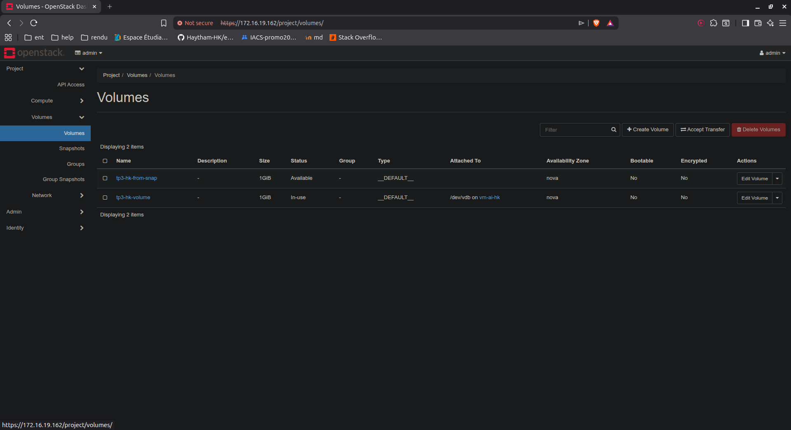
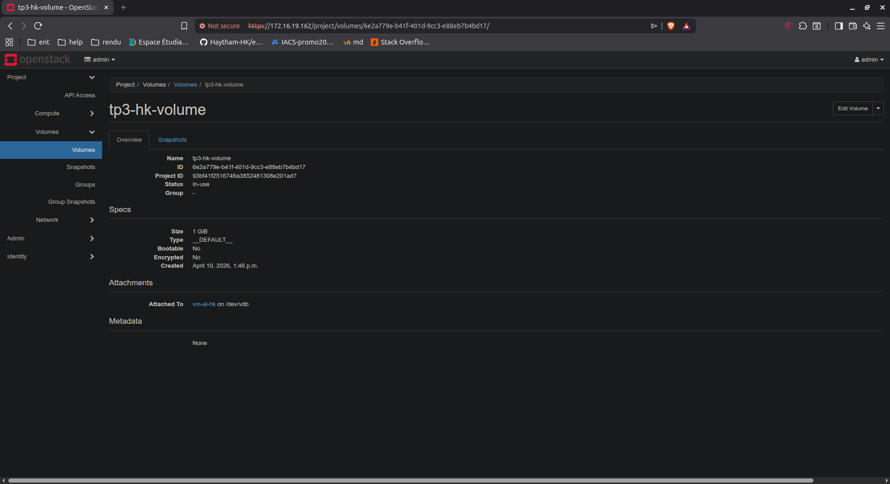
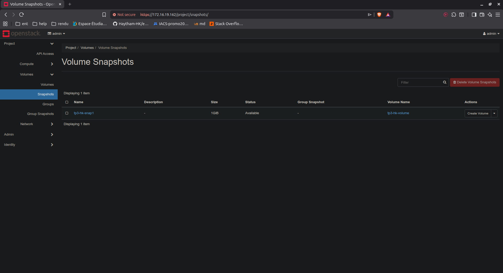
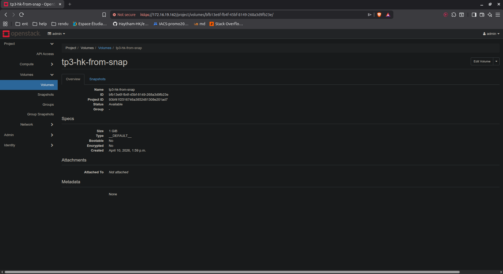
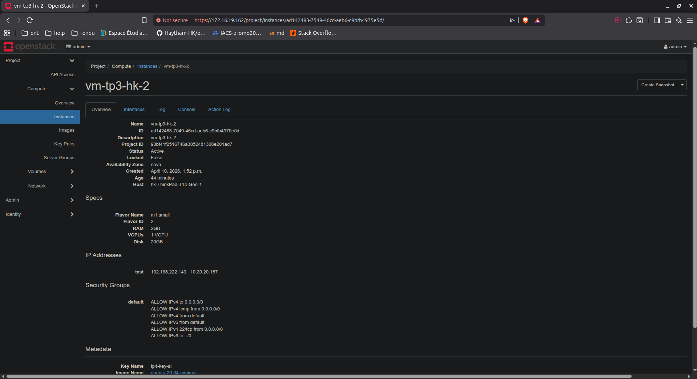
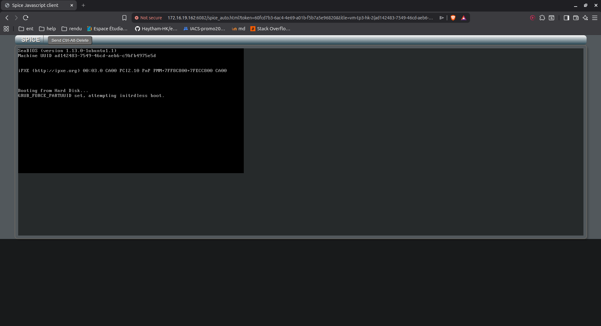
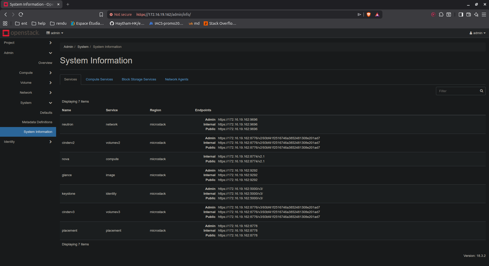
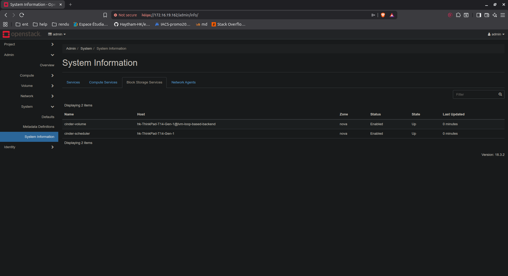
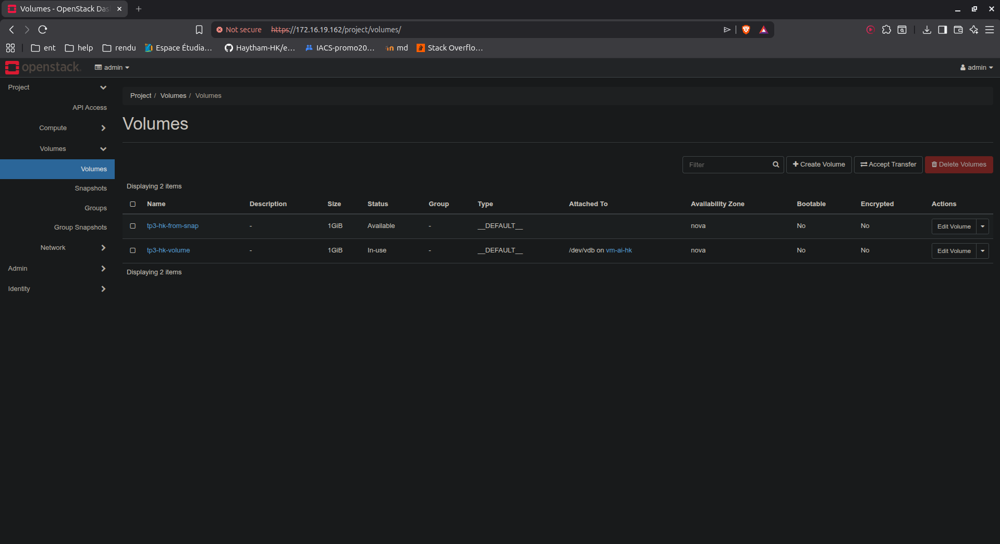

# TP3 — OpenStack Cinder & Swift

This practical lab documents a **Cloud Computing & Virtualisation** assignment focused on OpenStack storage services.  
The work demonstrates the **Cinder block storage workflow** (volume creation, snapshotting, and reuse) and checks the **Swift/Object Store** availability from the dashboard.

## What was done

1. Created and reviewed a Cinder volume (`tp3-hk-volume`).
2. Created a volume snapshot (`tp3-hk-snap1`).
3. Created a new volume from the snapshot (`tp3-hk-from-snap`).
4. Booted and inspected an instance (`vm-tp3-hk-2`) and opened the SPICE console.
5. Verified admin/system services for Cinder (`cinder-volume`, `cinder-scheduler`).
6. Confirmed that **Object Store** is not available in the project menu in this environment.

## Technologies used

| Category | Technologies |
|---|---|
| Cloud platform | OpenStack |
| Dashboard | Horizon (Web UI) |
| Block storage | Cinder |
| Compute | Nova |
| VM access | SPICE Console |
| System context | Linux-based OpenStack host |

## Screenshots

### 1) Volumes list

### 2) Volume details (`tp3-hk-volume`)

### 3) Snapshots list

### 4) Volume from snapshot (`tp3-hk-from-snap`)

### 5) Instance details (`vm-tp3-hk-2`)

### 6) SPICE console

### 7) Admin system information

### 8) Admin services view

### 9) Project menu (no Object Store)

