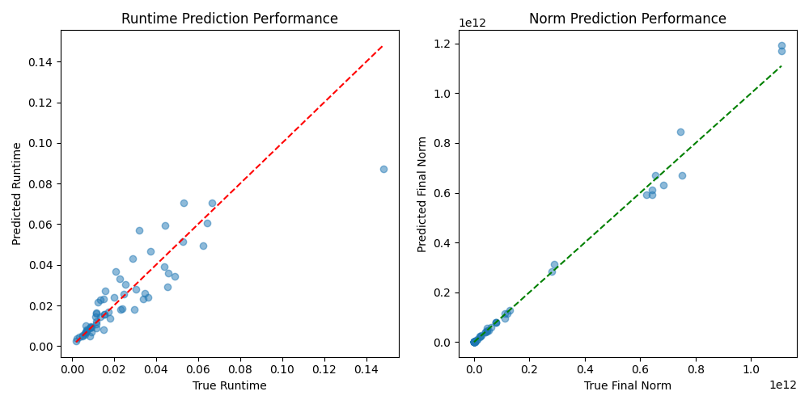

# ALOT: AI-driven Lattice Optimization Tool

**ALOT** is a research-focused mini-project that leverages Machine Learning to optimize lattice reduction algorithms in cryptography. By predicting the performance (runtime and quality) of algorithms like **LLL** and **BKZ**, it recommends the most efficient strategy for a given lattice dimension and time constraint.

Developed as part of the Cloud Computing & Virtualization module (CI IACS, 2026).

---


## Key Features
- **Data Collection:** Automated generation of synthetic lattices and performance profiling using `fpylll`.
- **Machine Learning Models:** Two **Random Forest Regressors** to predict:
  - **Runtime:** Expected duration of the reduction ($R^2 \approx 0.77$).
  - **Quality:** Final norm of the shortest vector found ($R^2 \approx 0.99$).
- **Smart Recommender:** Suggests the optimal algorithm (LLL/BKZ) and parameters ($\delta$ for LLL, $\beta$ for BKZ) based on user-defined time limits.
- **Real-time Validation:** Execute recommended reductions on live lattices to verify AI predictions.

---

## Project Structure
- `app.py`: Main CLI application (ALOT).
- `lattice_optimizer.py`: Core logic for strategy recommendation and model loading.
- `model_trainer.py`: Script to train the Random Forest models from collected data.
- `data_collector.py`: Profiling script to generate the dataset using `fpylll`.
- `lattice_data.csv`: The profiling dataset used for training.
- `*.pkl`: Serialized pre-trained AI models.
- `model_performance.png`: Visualization of the model's prediction accuracy.
- `rapport.tex`: LaTeX source for the project report.

---

## Installation & Setup

### Prerequisites
- Python 3.10+
- **`fpylll`**: Requires system-level dependencies (GMP, MPFR, FPLLL). On Ubuntu:
  ```bash
  sudo apt-get install libgmp-dev libmpfr-dev libfplll-dev
  ```

### Installation
1. **Clone the repository:**
   ```bash
   git clone https://github.com/your-username/lattice-optimization-ai.git
   cd lattice-optimization-ai
   ```

2. **Create a virtual environment:**
   ```bash
   python -m venv venv
   source venv/bin/activate  # On Windows: venv\Scripts\activate
   ```

3. **Install dependencies:**
   ```bash
   pip install -r requirements.txt
   ```

---

## Usage

### 1. Run the Tool (ALOT)
Launch the interactive CLI to get recommendations and test reductions:
```bash
python app.py
```

### 2. Train Models (Optional)
If you wish to update the models with the existing data:
```bash
python model_trainer.py
```

### 3. Collect New Data (Optional)
To generate a new dataset from scratch:
```bash
python data_collector.py
```

---

## Performance
The models achieve high accuracy on standard lattice reduction tasks:



---
