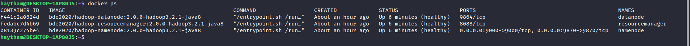
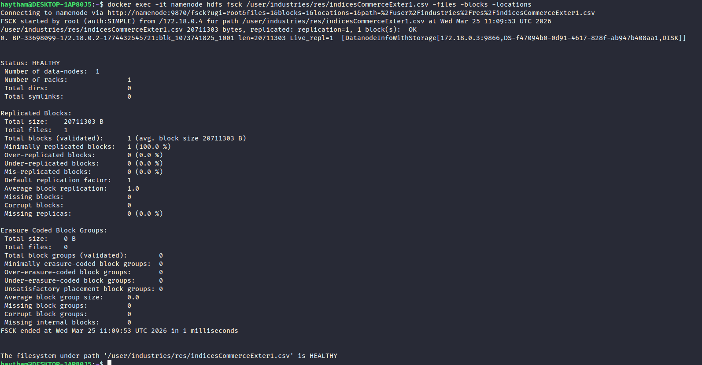
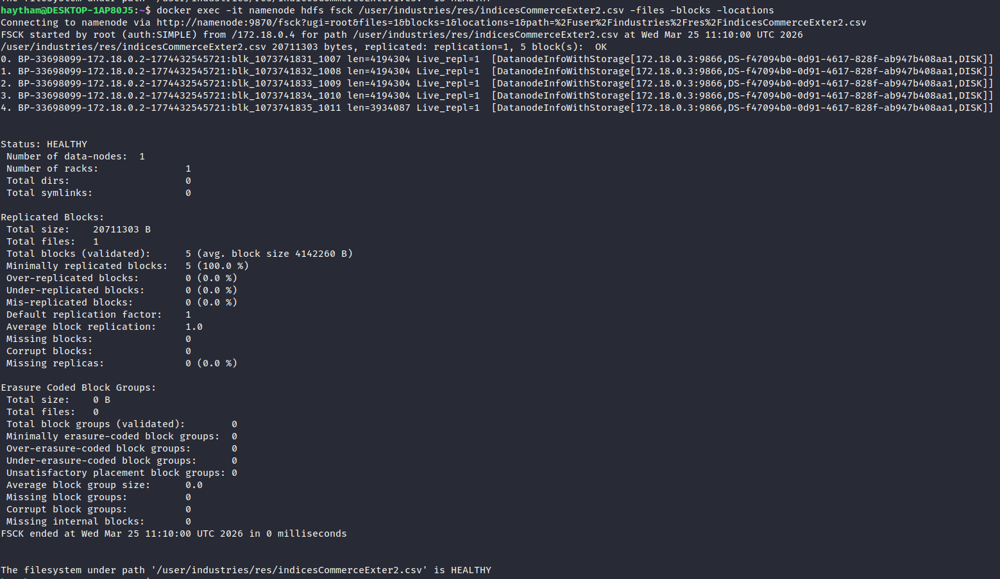
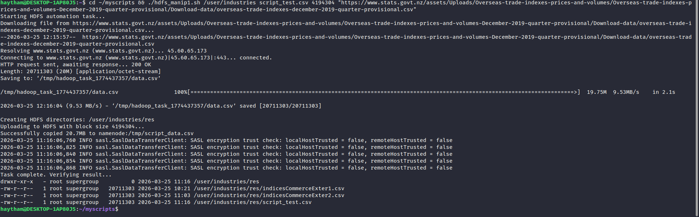
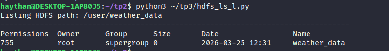

# TP 1-2-3: HDFS & Hadoop Programming

This project is a part of a first-year engineering coursework at ENSA. It served as a practical introduction to the Hadoop ecosystem, focusing on the Hadoop Distributed File System (HDFS) and basic MapReduce programming.

This was an early experience with Big Data technologies and a great learning opportunity.

## Part 1: HDFS Commands

The project started with an introduction to the basic HDFS commands for managing files and directories.

Here are some examples of the commands used:

*Caption: Example of listing files in HDFS.*

*Caption: Creating directories and moving files.*

## Part 2: First MapReduce Program

Next, a simple MapReduce program was written to count word occurrences in a text file. This was a hands-on way to understand the MapReduce paradigm.

The following screenshots show the process:

*Caption: The source code of the MapReduce job.*

*Caption: Compiling and creating the JAR file.*

*Caption: Running the MapReduce job on the input data.*

*Caption: The output of the word count job.*

## Part 3: Another MapReduce Example

Another MapReduce job was implemented to process a different dataset.

*Caption: Another example of a MapReduce job execution.*

## Conclusion

This project was a valuable first step into the world of Big Data. It provided a solid foundation in HDFS and MapReduce, which can be built upon in future projects.
