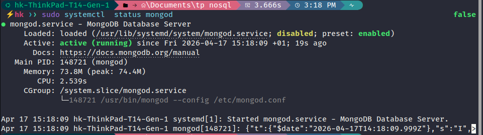
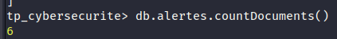
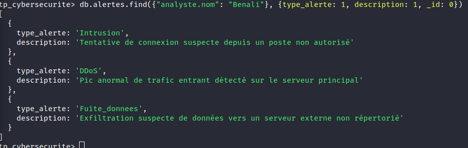
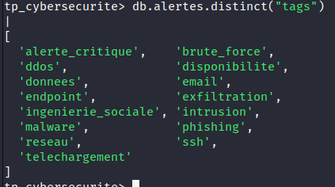
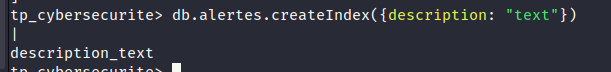
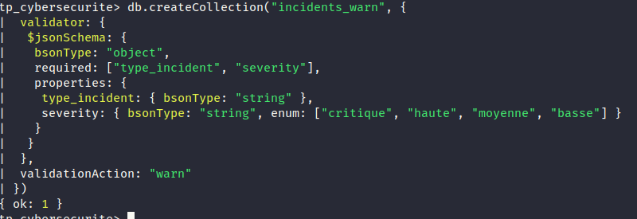
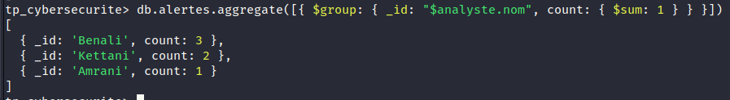
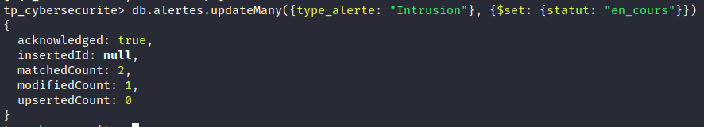
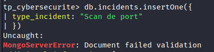
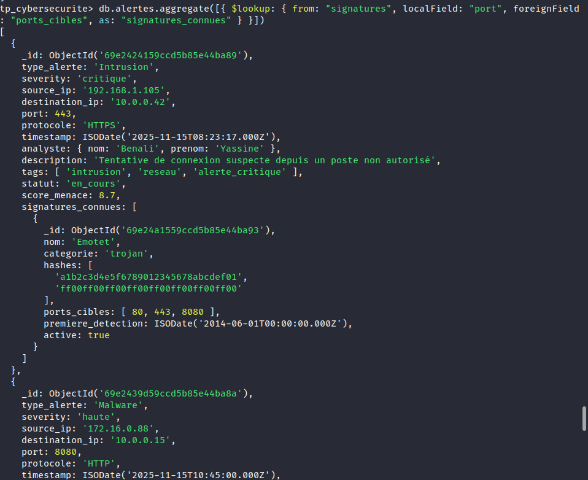

# TP 5 : NoSQL avec MongoDB - Gestion des Alertes de Sécurité

Ce projet documente la réalisation du TP 5 portant sur l'utilisation de **MongoDB** comme base de données NoSQL pour la gestion d'un système d'alertes de sécurité.

## Technologies Utilisées

- **Base de données :** MongoDB (NoSQL orienté document)
- **Interface :** MongoDB Shell (mongosh)
- **Concepts :** CRUD, Opérateurs de filtrage, Indexation, Framework d'agrégation, Validation de schéma.

## Travail Réalisé

### 1. Configuration et État initial
Nous avons commencé par vérifier que le service MongoDB était opérationnel sur le système.

### 2. Insertion de Données
Nous avons exploré les méthodes d'insertion de documents (`insertOne` et `insertMany`) pour peupler notre collection d'alertes.

- **Insertion unique :**

- **Insertion multiple :**

### 3. Consultation et Filtrage
Utilisation de `find()` avec des projections et des opérateurs pour extraire des informations spécifiques.

- **Nombre total de documents :**

- **Recherche avec projection (Filtre : Benali) :**

- **Utilisation des opérateurs `$gte` et `$lte` (Scores entre 7 et 9) :**

- **Extraction des tags distincts :**

### 4. Indexation et Performance
Optimisation des recherches via la création d'index.

- **Création d'un index de texte :**

- **Indexation sur l'IP source :**

### 5. Agrégation Avancée
Analyse des données à l'aide du framework d'agrégation (`$group`, `$unwind`, `$lookup`).

- **Groupement par Analyste :**

- **Désassemblage des tags (`$unwind`) et groupement :**

- **Jointure entre collections via `$lookup` :**

### 6. Mise à jour et Validation
Gestion de l'intégrité des données et mises à jour groupées.

- **Mise à jour en masse du statut :**

- **Test de validation de schéma (Erreur de mode strict) :**

- **Validation avec action "warn" (Succès avec avertissement) :**

### 7. Nettoyage
Suppression des documents obsolètes.

- **Suppression des alertes résolues :**

---
*Réalisé dans le cadre du module Big Data - ENSA.*
