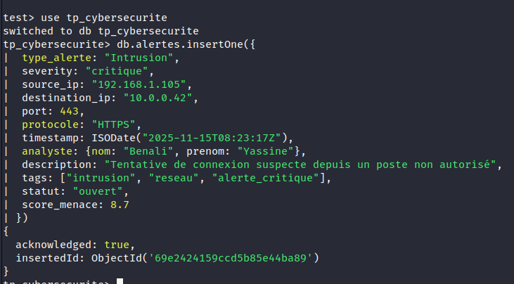
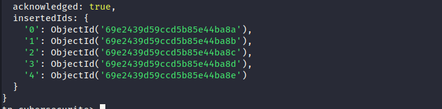
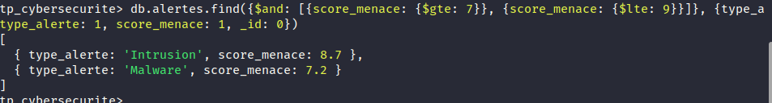
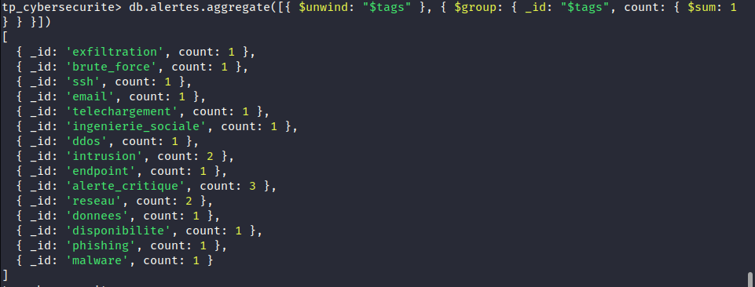
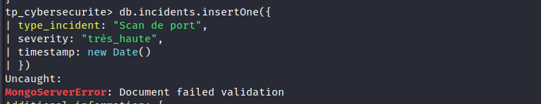
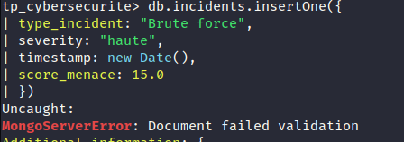

# TP 5 : NoSQL avec MongoDB - Gestion des Alertes de Sécurité

Ce projet documente la réalisation du TP 5 portant sur l'utilisation de **MongoDB** comme base de données NoSQL pour la gestion d'un système d'alertes de sécurité.

## Technologies Utilisées

- **Base de données :** MongoDB (NoSQL orienté document)
- **Interface :** MongoDB Shell (mongosh)
- **Concepts :** CRUD, Opérateurs de filtrage, Indexation, Framework d'agrégation, Validation de schéma (JSON Schema).

## Travail Réalisé

### 1. Configuration et État du Service
Vérification du statut du service MongoDB pour s'assurer qu'il est opérationnel.

### 2. Insertion de Données
Exploration des méthodes d'insertion pour peupler la collection `alertes`.

- **Insertion d'une alerte critique :**

- **Résultat d'une insertion multiple (insertMany) :**

### 3. Requêtes de Recherche et Filtrage
Utilisation de `find()` avec des projections et des opérateurs logiques.

- **Comptage du nombre total d'alertes :**

- **Recherche par analyste avec projection des champs :**

- **Filtrage par score de menace (entre 7 et 9) :**

- **Extraction de la liste des tags distincts :**

### 4. Indexation
Optimisation des performances de recherche.

- **Création d'un index textuel sur la description :**

### 5. Analyse de Données (Agrégation)
Utilisation du framework d'agrégation pour extraire des statistiques.

- **Nombre d'alertes par analyste :**

- **Nombre d'alertes par tag (utilisation de `$unwind`) :**

- **Jointure avec la collection `signatures` (utilisation de `$lookup`) :**

### 6. Mises à Jour et Validation de Schéma
Gestion du cycle de vie des alertes et contrôle de l'intégrité des données.

- **Mise à jour en masse du statut des intrusions :**

- **Échec de validation : Sévérité invalide (hors enum) :**

- **Échec de validation : Champs obligatoires manquants :**

- **Échec de validation : Score hors limites :**

- **Création d'une collection avec avertissement (`validationAction: "warn"`) :**

---
*Réalisé dans le cadre du module Big Data.*
